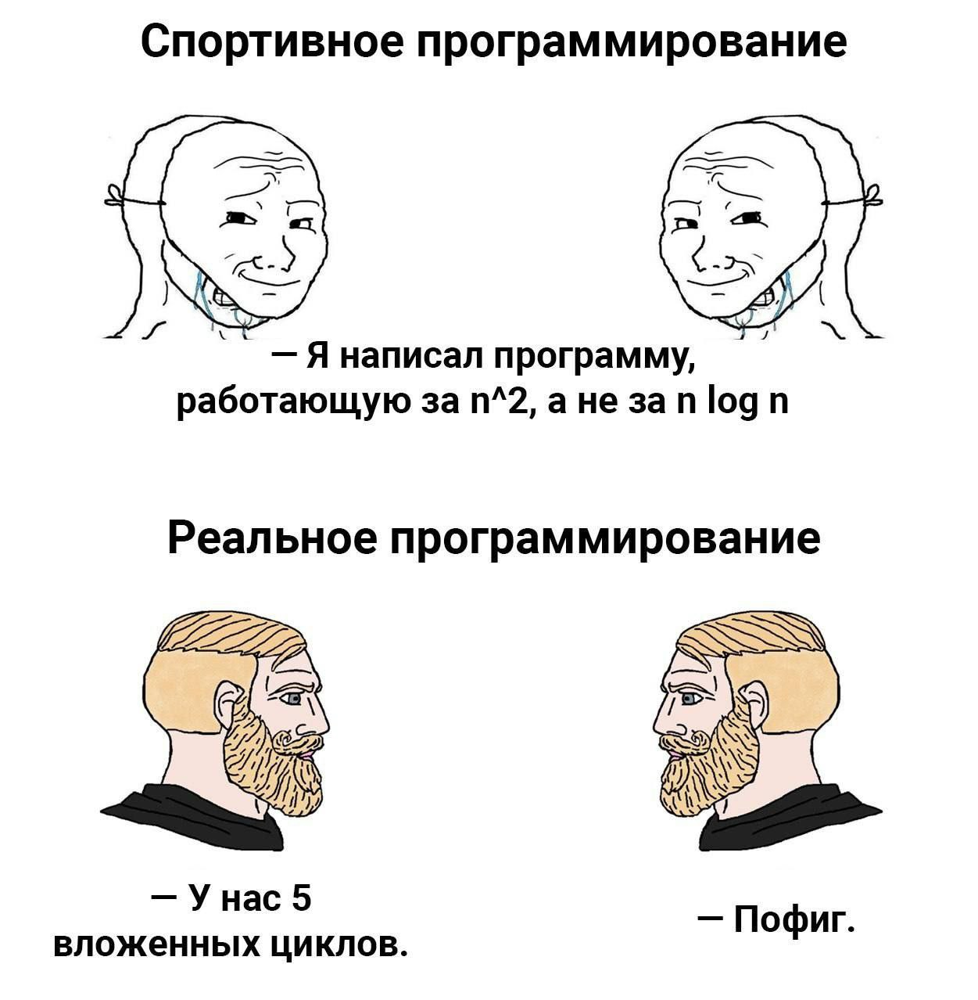

# Портфолио учебных работ 2025-2026

Подготовил: Лелло Андрей Евгеньевич 2об_ПОО/24

## Проекты

- [Работа 1 (two summ)](programming/work1.md)
- [Работа 2 (calculate)](programming/work2.md)
- [Работа 3 (бИнарное дерево)](programming/work3.md)
- [Работа 4 (Тг Боть)](programming/work4.md)
- [Работа 5 (Fибоначи)](programming/work5.md)
- [Работа 6 (Что таке decorator?)](programming/work6.md)
- [Работа 7 (Ещё декоратор)](programming/work7.md)
- [Работа 8 (Что по курсу цб?)](programming/work8.md)

